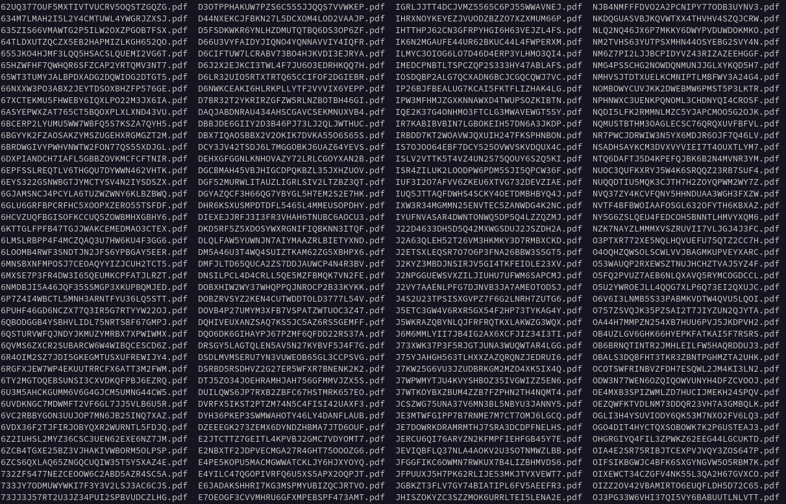

# Rerun

```
$ mkdir -p data/files
$ uv run scripts/unwrap.py -d data/files data/2024-04-SOZPHIL-TEST-7-pdf-urls.warc.gz
```



```
$ TORCH_CUDA_ARCH_LIST=8.9 time uv run scripts/md.py --dir data/files/
```
